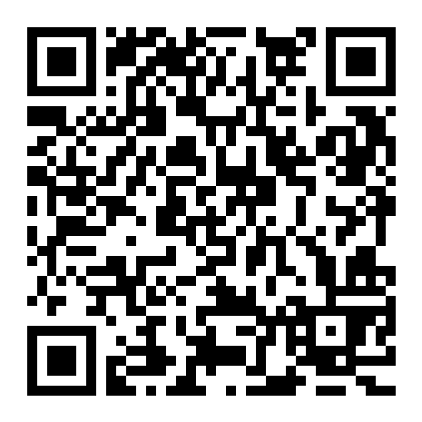

# CIA Installer

CIA Installer is a simple 3DS homebrew program for installing CIA files, with a file browser interface based on [3DES](https://github.com/psidex/3DES).

## Features

+ File browser interface based on [3DES](https://github.com/psidex/3DES)
+ Options to install CIAs with or without deleting them
+ A queue to quickly install multiple CIA files
+ Remote install with direct URL entry

## TODOs

+ Title manager feature
+ QR code scanning

## Install

### 3DSX

Download `CIA-Installer.3dsx` from the [releases page](https://github.com/Zachary-Rude/CIA-Installer/releases/latest) and copy it to `sdmc:/3ds/CIA-Installer` on your 3DS's SD card.

### CIA
Download `CIA-Installer.cia` from the [releases page](https://github.com/Zachary-Rude/CIA-Installer/releases/latest), copy it to your 3DS's SD card, and install it with FBI.

> [!WARNING]  
> Unless you are running the 3DSX version of this app, DO NOT use this app to install its own CIA as it will NOT work properly.

Alternatively, you can install this app by scanning the QR code below with FBI.

## Credits

File browser interface taken from [3DES](https://github.com/psidex/3DES), with modifications by me

Progress bar code from [Luma Updater](https://github.com/KunoichiZ/lumaupdate), with modifications by me

Error code decoding taken from [FBI](https://github.com/Steveice10/FBI)

Everything else made by me, except where stated otherwise